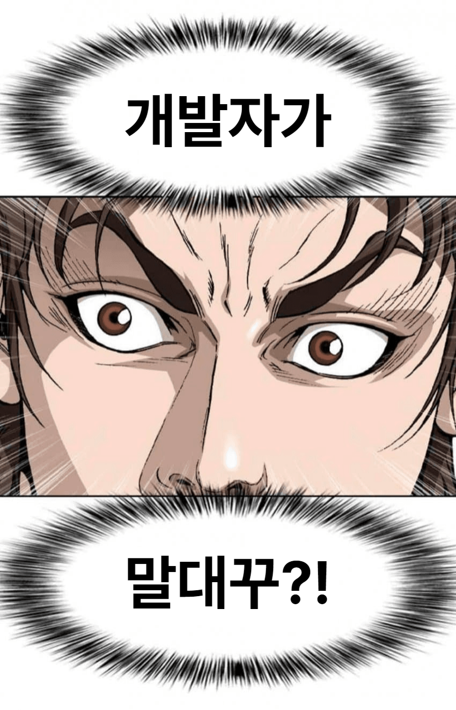
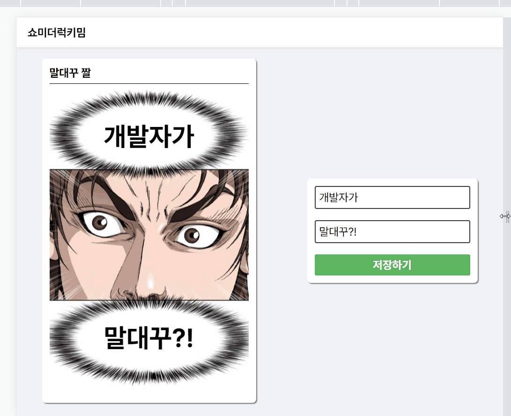

# 💥쇼미더럭키밈

말대꾸 밈 짤을 생성해주는 서비스

[서비스 바로가기](https://show-me-the-lucky-meme.vercel.app/)

> 개발자가... 말대꾸?!

## 😎특징

### 반응형 디자인

웹부터 스마트폰까지 모든 화면 사이즈에 반응하는 디자인 적용!

> % 와 vw 단위의 조합

### 커스터마이징

가지고 있는 이미지를 이용해 새로운 짤 생성 가능!

> 누끼는 못 따서 조금 잘린 건 비밀...

### PWA 적용

PWA 적용으로 어플로 설치 가능!

따로 [PWA Builder](https://www.pwabuilder.com/)를 이용해 Apk 파일로 패키징([다운로드](https://github.com/CaesiumY/show-me-the-lucky-meme/releases/tag/apk))

## 사용된 라이브러리

- [Pretendard](https://github.com/orioncactus/pretendard)
- [html-to-image](https://github.com/bubkoo/html-to-image)

## 🛠알려진 오류

> 오류 제보 환영!